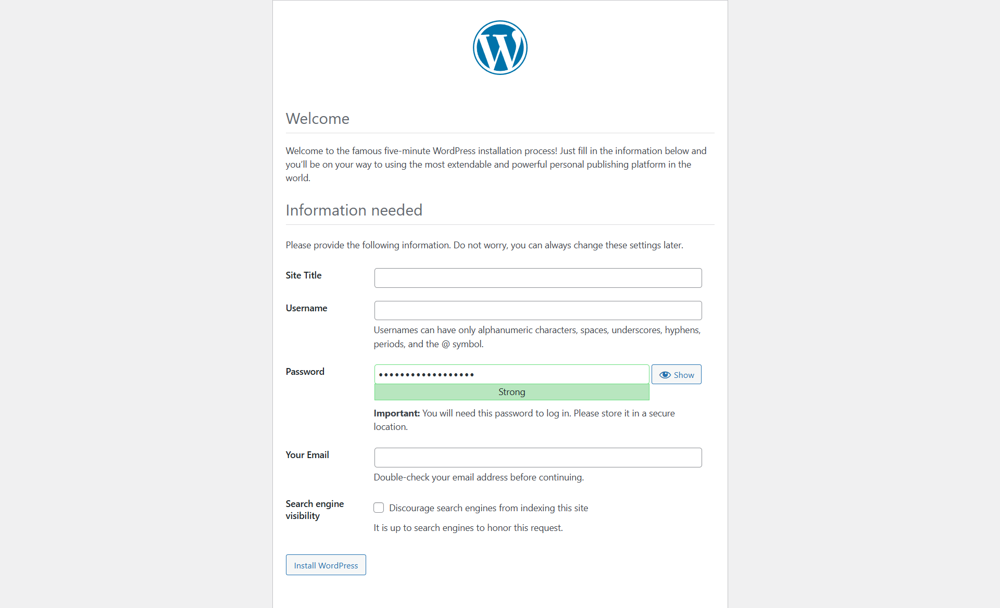
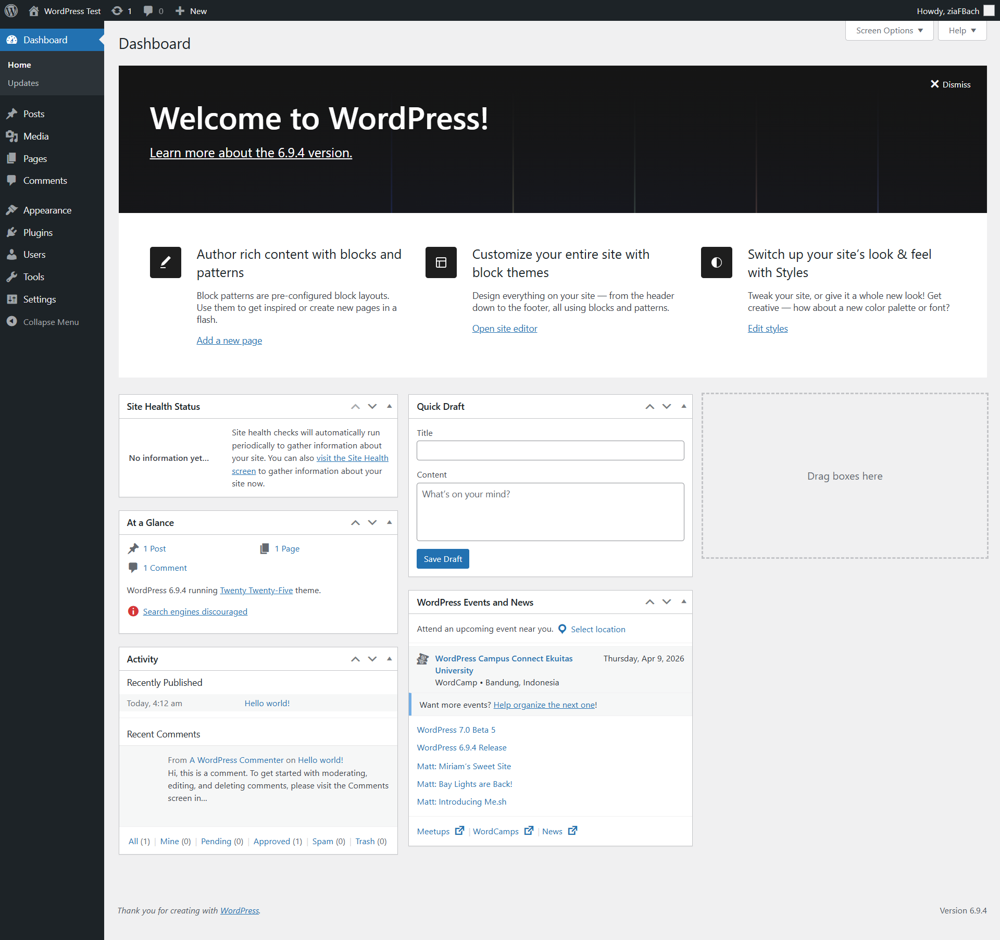
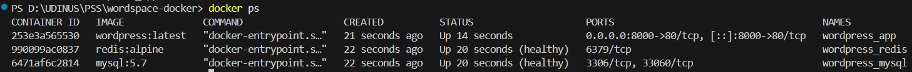
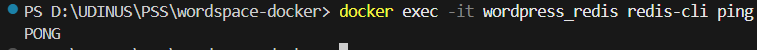

## Langkah Menjalankan Stack

### 1. Clone / Buat folder project
```bash
mkdir wordpress-docker
cd wordpress-docker
# Letakkan docker-compose.yml dan wp-config-extra.php di sini
```

### 2. Jalankan semua container
```bash
docker-compose up -d
```

Output yang diharapkan:
```
Creating network "wordpress-docker_wp_network" with driver "bridge"
Creating volume "wordpress-docker_mysql_data"  with default driver
Creating volume "wordpress-docker_wordpress_data" with default driver
Creating volume "wordpress-docker_redis_data" with default driver
Creating wordpress_mysql ... done
Creating wordpress_redis ... done
Creating wordpress_app   ... done
```

### 3. Cek status container
```bash
docker ps
```

### 4. Akses WordPress
Buka browser: **http://localhost:8000**

### 5. Stop stack (data tetap tersimpan)
```bash
docker-compose down
```

### 6. Hapus semua termasuk data
```bash
docker-compose down -v
```

---

## Penjelasan Konfigurasi docker-compose.yml

### Service: WordPress
```yaml
wordpress:
  image: wordpress:latest         # Official WordPress image dari Docker Hub
  ports:
    - "8000:80"                   # Host port 8000 → container port 80
  environment:
    WORDPRESS_DB_HOST: mysql:3306 # Nama service MySQL + port internal
    WORDPRESS_DB_NAME: wordpress_db
    WORDPRESS_DB_USER: wp_user
    WORDPRESS_DB_PASSWORD: wp_secret_password
  depends_on:
    mysql:
      condition: service_healthy  # Tunggu MySQL sehat sebelum start
  volumes:
    - wordpress_data:/var/www/html # Simpan file WordPress
  networks:
    - wp_network
```

### Service: MySQL
```yaml
mysql:
  image: mysql:5.7
  environment:
    MYSQL_ROOT_PASSWORD: root_super_secret
    MYSQL_DATABASE: wordpress_db   # Database langsung dibuat saat init
    MYSQL_USER: wp_user
    MYSQL_PASSWORD: wp_secret_password
  volumes:
    - mysql_data:/var/lib/mysql    # Persist data database
  healthcheck:
    test: ["CMD", "mysqladmin", "ping", ...]
    interval: 10s
    retries: 5
```

### Service: Redis
```yaml
redis:
  image: redis:alpine              # Versi ringan Redis
  command: redis-server --appendonly yes  # Aktifkan persistence AOF
  volumes:
    - redis_data:/data             # Simpan data Redis
  networks:
    - wp_network
```

---

## Redis Object Cache Setup

### Langkah 1: Masuk ke container WordPress
```bash
docker exec -it wordpress_app bash
```

### Langkah 2: Install WP-CLI (jika belum ada)
```bash
curl -O https://raw.githubusercontent.com/wp-cli/builds/gh-pages/phar/wp-cli.phar
chmod +x wp-cli.phar
mv wp-cli.phar /usr/local/bin/wp
```

### Langkah 3: Install plugin Redis Object Cache via WP-CLI
```bash
wp plugin install redis-cache --activate --allow-root
```

### Langkah 4: Tambahkan konfigurasi Redis ke wp-config.php
```bash
# Tambahkan baris berikut di wp-config.php SEBELUM "That's all, stop editing!"
wp config set WP_REDIS_HOST redis --allow-root
wp config set WP_REDIS_PORT 6379 --allow-root
```

Atau edit manual:
```bash
nano /var/www/html/wp-config.php
```
Tambahkan:
```php
define('WP_REDIS_HOST', 'redis');
define('WP_REDIS_PORT', 6379);
define('WP_REDIS_PREFIX', 'wp_cache_');
```

### Langkah 5: Aktifkan Redis Object Cache
```bash
wp redis enable --allow-root
```

---

## Testing & Verifikasi

### Test 1: WordPress dapat diakses
```
Browser → http://localhost:8000
```
Seharusnya muncul halaman instalasi WordPress.

### Test 2: Cek semua container berjalan
```bash
docker ps
```
Expected output:
```
CONTAINER ID   IMAGE              COMMAND                  STATUS          PORTS                  NAMES
abc123def456   wordpress:latest   "docker-entrypoint.s…"  Up 2 minutes    0.0.0.0:8000->80/tcp   wordpress_app
def456abc789   mysql:5.7          "docker-entrypoint.s…"  Up 3 minutes    3306/tcp               wordpress_mysql
789abc123def   redis:alpine       "docker-entrypoint.s…"  Up 3 minutes    6379/tcp               wordpress_redis
```

### Test 3: Koneksi MySQL
```bash
docker exec -it wordpress_mysql mysql -u wp_user -pwp_secret_password wordpress_db -e "SHOW TABLES;"
```
Setelah instalasi WordPress, akan muncul tabel-tabel WordPress.

### Test 4: Redis CLI Ping
```bash
docker exec -it wordpress_redis redis-cli ping
```
Expected output: `PONG`

### Test 5: Monitor Redis cache aktif
```bash
docker exec -it wordpress_redis redis-cli monitor
```
Buka WordPress di browser, akan terlihat operasi cache di terminal.

### Test 6: Cek keys di Redis
```bash
docker exec -it wordpress_redis redis-cli keys "*"
```

### Test 7: Data persistent setelah restart
```bash
# Restart semua container
docker-compose down
docker-compose up -d

# Data WordPress dan MySQL harus tetap ada
# Akses http://localhost:8000 — tidak perlu instalasi ulang
```

---

## Screenshot

### 1. WordPress Setup Page


### 2. WordPress Dashboard


### 3. Docker PS — 3 Containers Running


### 4. Redis CLI Ping Test


---

### 1. Kenapa perlu volume untuk MySQL?

Volume untuk MySQL berfungsi sebagai **persistent storage** — penyimpanan data yang bertahan meskipun container dihapus atau di-restart.

Tanpa volume, semua data database (post, user, settings WordPress) akan **hilang selamanya** saat container MySQL dihapus atau mengalami crash. Container Docker secara default bersifat *ephemeral* (sementara) — filesystem-nya hilang bersama container.

Dengan volume `mysql_data:/var/lib/mysql`:
- Data tersimpan di host machine, bukan di dalam container
- Container MySQL bisa dihapus, dibuat ulang, di-upgrade — data tetap aman
- Cocok untuk environment production maupun development

### 2. Apa fungsi `depends_on`?

`depends_on` mengatur **urutan start container** dan memastikan satu service siap sebelum service lain dijalankan.

Dalam konfigurasi ini:
```yaml
wordpress:
  depends_on:
    mysql:
      condition: service_healthy
```

WordPress tidak akan start sebelum MySQL benar-benar **healthy** (bukan sekadar "started"). Kondisi `service_healthy` menggunakan hasil `healthcheck` dari service MySQL.

Tanpa `depends_on`, WordPress bisa start lebih dulu dari MySQL → koneksi database gagal → error saat instalasi.

> **Catatan:** `depends_on` hanya mengontrol urutan start, bukan urutan stop. Saat `docker-compose down`, semua container berhenti bersamaan.

### 3. Bagaimana cara WordPress container connect ke MySQL?

WordPress terhubung ke MySQL melalui **Docker internal network** (`wp_network`).

Mekanismenya:
1. Kedua container berada di network yang sama (`wp_network`)
2. Docker secara otomatis menyediakan **DNS resolution internal** — nama service `mysql` langsung bisa di-resolve ke IP container MySQL
3. WordPress dikonfigurasi dengan `WORDPRESS_DB_HOST: mysql:3306` → Docker resolve `mysql` → IP container MySQL → koneksi berhasil

Ini berbeda dengan akses dari luar container yang membutuhkan `localhost:3306` (exposed port). Antar container menggunakan nama service sebagai hostname.

### 4. Apa keuntungan pakai Redis untuk WordPress?

Redis berfungsi sebagai **Object Cache** — menyimpan hasil query database dan komputasi PHP di memori (RAM) sehingga request berikutnya tidak perlu ke database lagi.

| Aspek | Tanpa Redis | Dengan Redis |
|-------|------------|-------------|
| Setiap page load | Query ke MySQL | Ambil dari RAM |
| Waktu respons | ~200-500ms | ~5-50ms |
| Beban MySQL | Tinggi | Berkurang drastis |
| Skalabilitas | Terbatas | Lebih baik |

Keuntungan konkret:
- **Performa lebih cepat** — data populer (menu, widget, query umum) disimpan di RAM
- **Beban server berkurang** — MySQL tidak perlu query yang sama berulang kali  
- **Scalability** — cocok untuk traffic tinggi
- **Session storage** — bisa juga dipakai untuk menyimpan PHP sessions

---

## 📚 Referensi

- [WordPress Docker Hub](https://hub.docker.com/_/wordpress)
- [MySQL Docker Hub](https://hub.docker.com/_/mysql)
- [Redis Docker Hub](https://hub.docker.com/_/redis)
- [Redis Object Cache Plugin](https://wordpress.org/plugins/redis-cache/)
- [Docker Compose Documentation](https://docs.docker.com/compose/)
